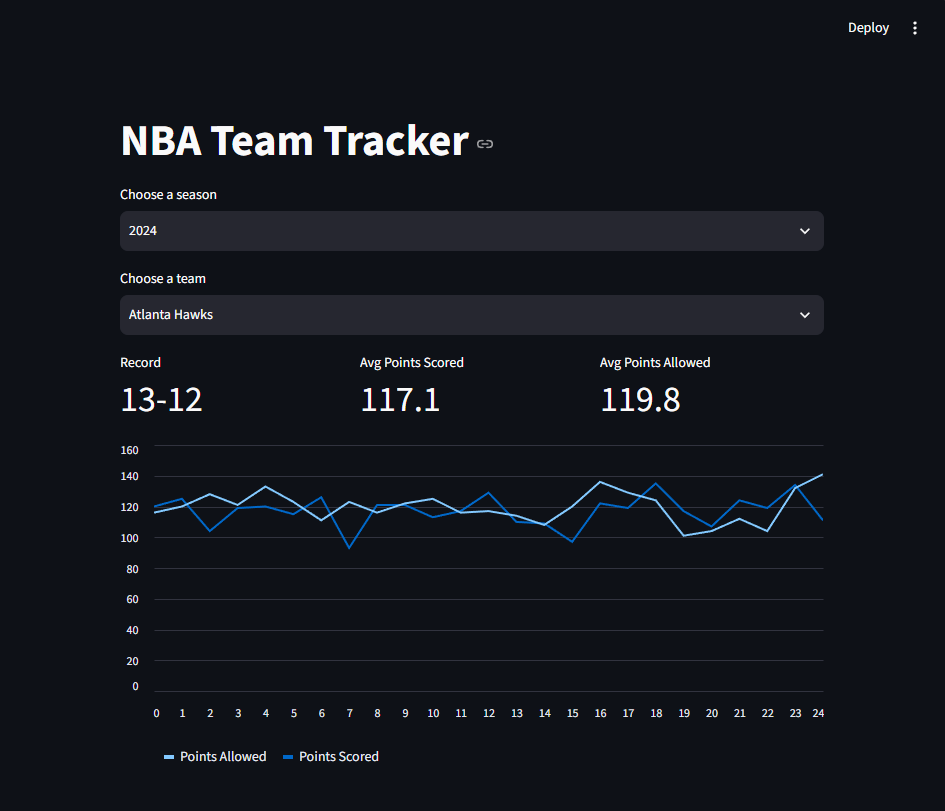

# NBA Team Tracker
 
A Streamlit dashboard that pulls live NBA game data and computes team records and scoring stats — built as a hands-on project to learn API integration, data handling, and building interactive dashboards in Python.
 


 
## What it does
 
- Pick any NBA team and season (2020–2024) from dropdowns
- See the team's win-loss record, average points scored, and average points allowed
- View a line chart tracking points scored/allowed across every game in the season
All stats are **computed from raw game data**, not pulled from a pre-built stats endpoint — the [balldontlie](https://balldontlie.io) API's free tier only exposes teams, players, and game scores, so win/loss records and scoring averages are calculated directly from individual game results using Python.
 
## Tech stack
 
- **Python** — core logic
- **Streamlit** — interactive web dashboard
- **pandas** — data shaping for the chart
- **requests** — API calls
- **balldontlie API** — NBA game data
## Notable design decisions
 
- **Caching (`st.cache_data`)** — avoids re-fetching data Streamlit has already pulled for a given team/season, reducing redundant API calls
- **Graceful degradation** — the free API tier is rate-limited to 5 requests/minute; instead of crashing, the app catches failed requests and shows a friendly warning telling the user to wait and retry
- **API key security** — the API key is loaded from a local `.env` file (excluded from version control via `.gitignore`), never hardcoded
## Setup
 
1. Clone this repo and navigate into it
2. Create a virtual environment and activate it:
```
   python -m venv venv
   venv\Scripts\Activate.ps1      # Windows (PowerShell)
   source venv/bin/activate       # Mac/Linux
```
3. Install dependencies:
```
   pip install streamlit pandas requests python-dotenv
```
4. Get a free API key at [app.balldontlie.io](https://app.balldontlie.io)
5. Create a `.env` file in the project root:
```
   BALLDONTLIE_API_KEY=your-key-here
```
6. Run the app:
```
   streamlit run app.py
```
 
## Known limitations
 
- The free tier of the balldontlie API doesn't include individual player stats or pre-built season averages — this project works entirely from game-level data (final scores) as a result
- Free tier is capped at 5 requests/minute; rapid clicking through many teams may briefly trigger the rate-limit warning
## Possible future improvements
 
- Add a "compare two teams" view
- Show a team's win/loss streak, not just overall record
- Deploy to Streamlit Community Cloud for a live public link